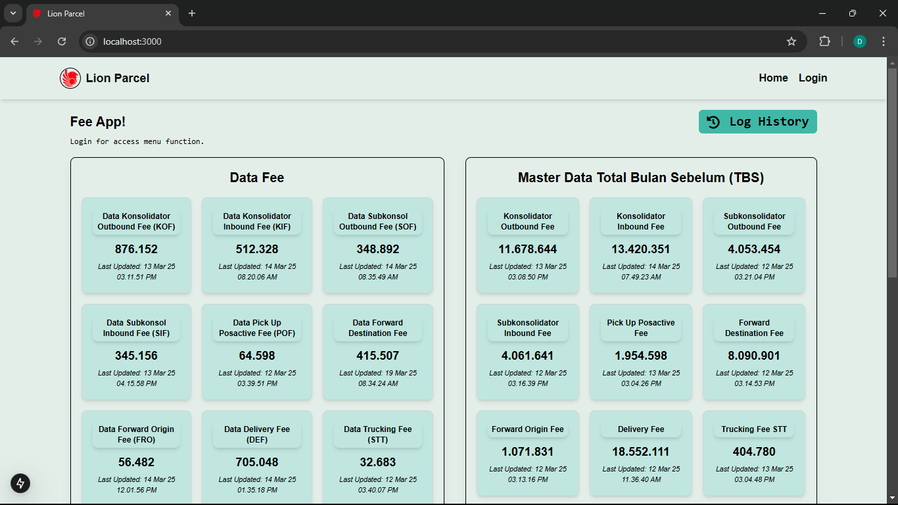
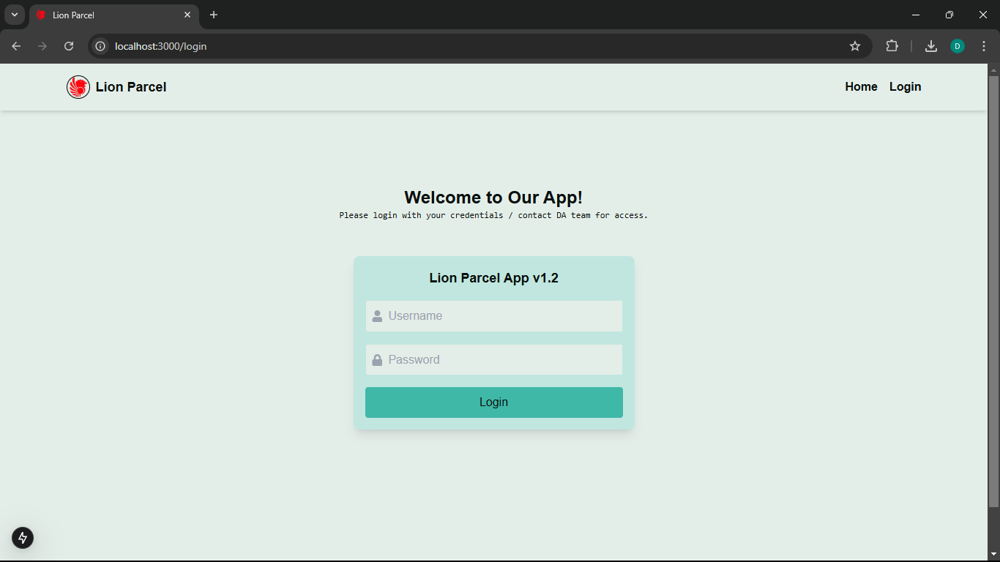
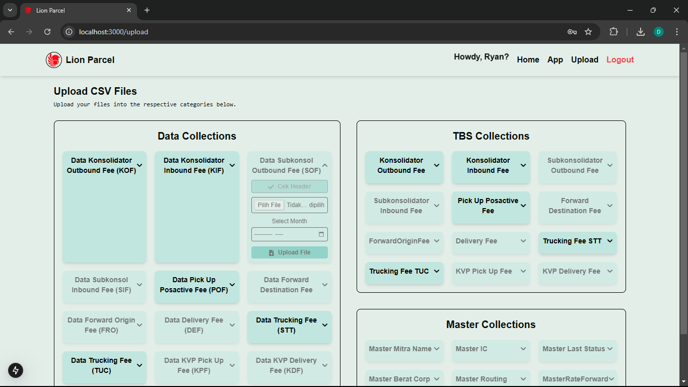
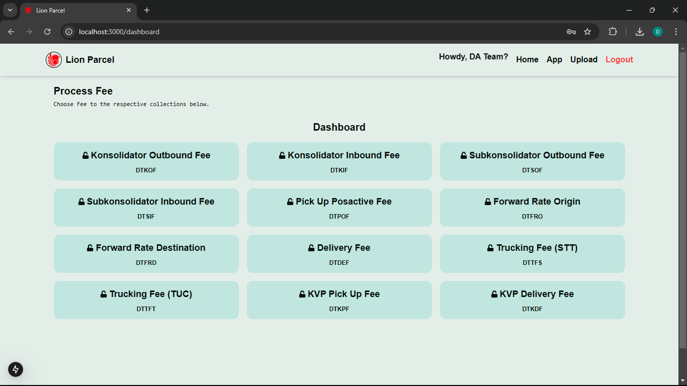
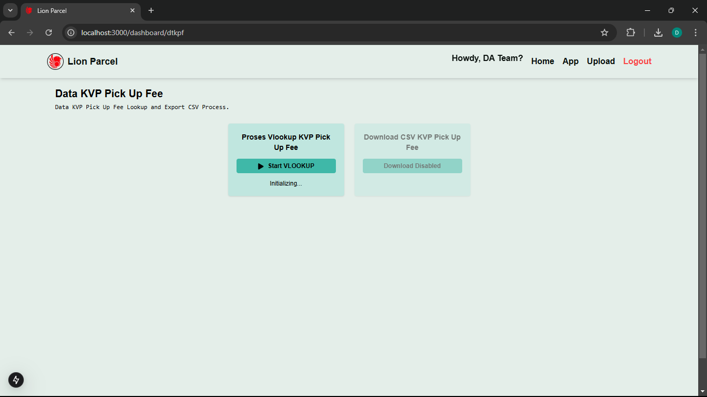
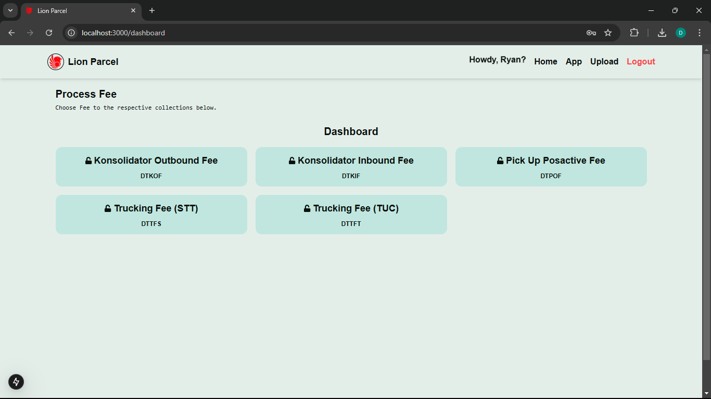

# Lookup Project

The Lookup Project is a full-stack application designed for managing and processing data collections. It includes a **backend** service built with Go (Golang) and MongoDB, and a **frontend** application built with Next.js and TypeScript.

## Features

 - **Backend**:
   - MongoDB integration for data storage and retrieval.
   - CSV upload, validation, and export functionality.
   - Data processing with aggregation pipelines.
   - User authentication and access control.

 - **Frontend**:
   - User-friendly interface for managing data collections.
   - File upload and log history views.
   - Responsive design optimized for desktop and mobile devices.

## Project Structure

```
/backend   - Contains the Go backend service
/frontend  - Contains the Next.js frontend application
```

## Prerequisites

 - **Backend**:
   - Go 1.18 or later
   - MongoDB instance
 - **Frontend**:
   - Node.js 16.x or later
   - npm or yarn package manager

## Setup Instructions

### 1. Clone the Repository

 ```bash
 git clone <repository-url>
 cd lookupproject
 ```

### 2. Backend Setup

1. Navigate to the backend directory:
```bash
cd backend
```

2. Create a `.env` file:
```bash
touch .env
```

3. Add the following environment variables to the `.env` file:
```
MONGODB_URI=mongodb://localhost:27017
MONGODB_DATABASE="yourdatabasename"
PORT=8080
```

4. Install dependencies:
```bash
go mod tidy
```

5. Start the backend server:
```bash
go run main.go
```

The backend server will run at [http://localhost:8080](http://localhost:8080).

### 3. Frontend Setup

1. Navigate to the frontend directory:
```bash
cd frontend
```

2. Create a `.env.local` file:
```bash
touch .env.local
```

3. Add the following environment variable to the `.env.local` file:
```
NEXT_PUBLIC_API_URL=http://localhost:8080
```

4. Install dependencies:
```bash
npm install
# or
yarn install
```

5. Start the development server:
```bash
npm run dev
# or
yarn dev
```

The frontend application will run at [http://localhost:3000](http://localhost:3000).

## Contributing

We welcome contributions! Follow these steps to get started:

1. Fork the repository and clone it to your local machine:
```bash
git clone https://github.com/amirakbarwicaksono/lookupproject.git
```

2. Create a new branch for your feature or bug fix:
```bash
git checkout -b feature/your-feature-name
```

3. Make your changes and commit them:
```bash
git commit -m "Description of your changes"
```

4. Push your branch to your forked repository:
```bash
git push origin feature/your-feature-name
```

5. Open a pull request to the main repository.

## Added Frontend Display

 The frontend application includes the following features:

 - **Home Page**:
Home Page

   - Provides an overview of data collections with their respective counts.
   - Displays the last updated timestamp for each collection.
   - Includes links to log history for detailed insights.

 - **Log History Page**:
Log History & Export CSV

   - Displays detailed logs of uploaded data, including timestamps, collection names, and statuses.
   - Supports pagination for better navigation of logs.
   - Allows exporting logs as a CSV file.

 - **Login Page**:
Login Page

   - Enables user authentication with username and password.
   - Includes a responsive design with real-time error handling.
   - Supports "Enter" key submission for a seamless login experience.

 - **Upload Page**:
Admin

User(PIC)

   - Allows users to upload CSV files into various collections.
   - Includes a date range selection feature for specific collections like "Master Rate Forward".
   - Displays upload progress, success, and error messages.
   - Provides a header download option for collections.

 - **Dashboard**:
Admin Dashboard

Detail Fee

User(PIC) Dashboard

   - Supports process lookup and reconcile and export final process to CSV.

 - **Mobile Menu**:
Mobile Menu


   - Provides a collapsible navigation menu optimized for mobile devices.
   - Includes links to all major sections of the application.
   - Features smooth animations and responsive design for better usability.


 These features enhance user experience by providing better control, visibility, and accessibility for managing data collections.

## License

 This project is licensed under the MIT License. See the [LICENSE](LICENSE) file for details.

